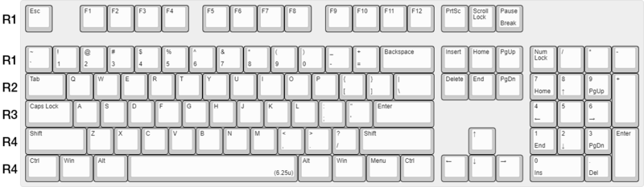

# 프로젝트 목표  
C 언어로  
백그라운드에 실행시켜두면  
정해진 시간 동안  
키보드 키 각각의 클릭 횟수를 세어 알려주는  
프로그램 만들기
# 프로젝트 목적
클릭 횟수 기록을 세어주는 프로그램이 있으면  
사용자가 자주 이용하는 키는 크기를 키우거나 색상을 돋보이게 하고  
그렇지 않은 키는 크기를 줄이거나 색상을 두드러지지 않게 하는 등  
사용자에게 알맞은 키보드를 만드는 데 활용할 수 있을 것으로 기대함  
# 프로젝트 특이사항 및 제작 환경
이 프로젝트에서 클릭이란 키 버튼을 눌렀다 떼는 것임.

`norminette -R CheckForbiddenSourceHeader`, `gcc -Wall -Wextra -Werror` 자가 테스트 통과  

**OS**: Windows 10  
**bash (`git --version`)**: git version 2.30.0.windows.2  
**norminette**: https://github.com/hivehelsinki/norminette-client  
**gcc (`gcc --version`)**:  
`gcc.exe (MinGW-W64 x86_64-posix-seh, built by Brecht Sanders) 10.1.0`  
`Copyright (C) 2020 Free Software Foundation, Inc.`  
`This is free software; see the source for copying conditions.  There is NO`  
`warranty; not even for MERCHANTABILITY or FITNESS FOR A PARTICULAR PURPOSE.`
# 해결할 점
## 같은 입력이지만 위치가 다른 키보드 키는 어떻게 구별할 것인가
~~[여기](https://www.keyboardtester.com/tester.html)서 키보드 자판을 체크하는 방법을 참고하면 될 듯~~  
~~해당 사이트에서는 Shift, Ctrl, Alt, Enter를 어느 위치의 키로 입력했는지 확인할 수 없음~~  
[Virtual-Key Codes](https://docs.microsoft.com/ko-kr/windows/win32/inputdev/virtual-key-codes)에서 Shift, Ctrl, Alt 좌우 키 값이 다름을 확인함  
다만 Enter는 확인할 수 없어 현재 내가 사용하는 104 배열 키보드를 기준으로 코드를 짜면서 확인해야 할 듯  

## 백그라운드에서 어떻게 동작시킬 것인가
프로그램이 백그라운드에서 동작하면서 키 별로 카운트 해야 하는데  
터미널이 아닌 곳에서 키 입력해도 잘 카운트 하는 것을 확인함  
시간 종료 후 키 별 클릭 횟수를 터미널 출력과 동시에 특정 위치에 txt 파일로 저장하거나  
UI를 추가하여 실행, 종료가 버튼 이미지 마우스 클릭으로도 가능하게 구현하면 좋을 듯
## 어떻게 실행시킬 것인가
Makefile을 작성할 예정  
헤더 파일, 소스 파일 또한 정리할 예정  
## vKey Constant/value, Description 알아보기 쉽게 html 파일 만들기
104-Key.html 파일 수정해서 키보드 자판에 vKey 값을 표시하여  
GetAsyncKeyState() 함수의 인자를 알기 쉽게 정리할 예정  
# 제작 함수
## ft_keyclickcount
### 프로토 타입과 설명
`unsigned int	ft_keyclickcount(unsigned int second, int vkey);`  
> 클릭한 횟수를 기록할 초 단위의 시간과  
> 키보드의 키에 해당하는 16진수 값을 인자로 받아  
> 해당 시간동안 해당 키를 클릭한 횟수를 반환합니다.
## main
### 프로토 타입과 설명
`int	main(void);`  
> 현재는 테스트용(Left SHIFT key, 5 seconds)으로 작성되었지만  
> 추후에는 클릭 횟수를 셀 키보드 키와 시간을 입력받아  
> 시간이 끝나면 클릭 횟수를 출력하는 프로그램이 될 예정입니다.
# 참고 자료
[[C언어/C++] 시간 관련함수에 대해서 (time, localtime, ctime, asctime)](https://blockdmask.tistory.com/417)  
[GetAsyncKeyState 함수?](https://skmagic.tistory.com/32)